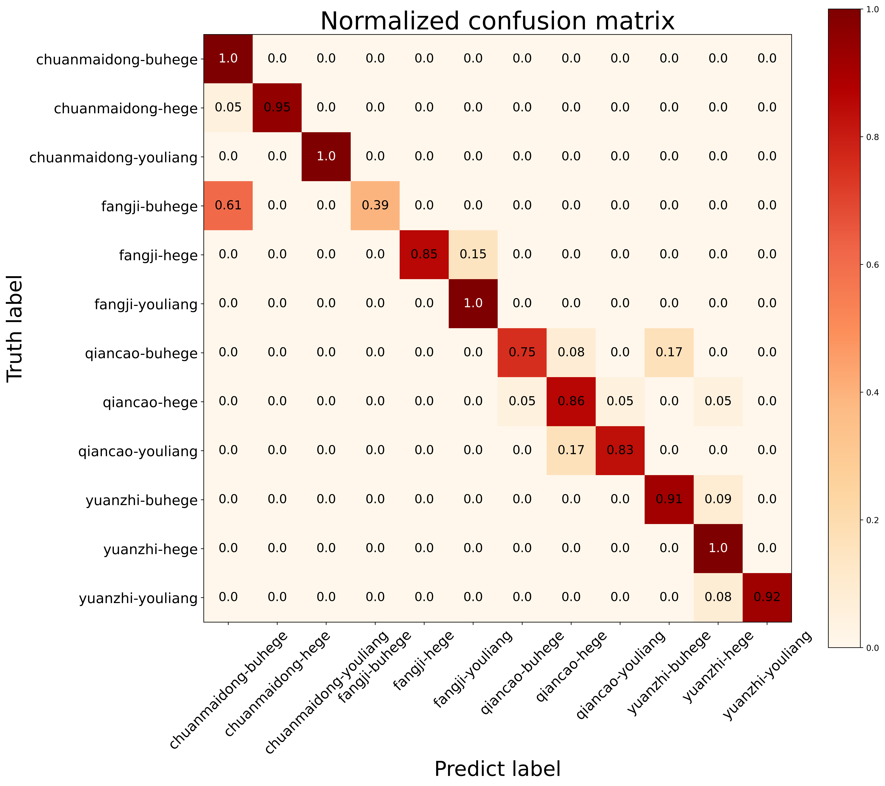

# 1 项目说明
```
（1）本项目需要解决的问题：给中药数据集划分类别。
（2）本项目使用resnet18+mixup+labelsmoothing。
（3）由于数据保密性，暂不提供数据集。
（4）分类效果展示在文档最后。
（5）本项目的GitHub地址为：https://github.com/AddPear/MedicionClassification-ResNet18
```

# 2 数据集说明
```
（1）数据集共有4000余张。
（2）需要分类的中药饮片共有四个类别，每个类别都有不合格、合格与优良三个等级。
（3）由于数据集的保密性，读者可以使用自己的数据集。
```


## 2.1 待划分类别(12类)
- [x] chuanmaidong-buhege
- [x] chuanmaidong-hege
- [x] chuanmaidong-youliang
- [x] fangji-buhege
- [x] fangji-hege
- [x] fangji-youliang
- [x] qiancao-buhege
- [x] qiancao-hege
- [x] qiancao-youliang
- [x] yuanzhi-buhege
- [x] yuanzhi-hege
- [x] yuanzhi-youliang

## 2.2 数据集推荐存放方式
- 数据集：建议用自己的
- 划分数据集代码位置：datasets/devide_data.py
- 推荐的数据集存放位置如下：
```
├── data/zhongyao-data/
|   ├── test/
|       ├── chuanmaidong-buhege
|       ├── chuanmaidong-hege
|       ├── chuanmaidong-youliang
|       ├── ...
|   ├── train/
|   ├── val/
├──
```

## 2.3 部分资源的网盘链接
```
预训练权重、中药的训练权重与小型测试集已上传至百度网盘，链接与提取码如下：
链接：https://pan.baidu.com/s/19SxDffTm2oQdqqSxCRxN_A 
提取码：lili

推荐文件放置位置：
├── data
|   ├── zhongyao-test/
|       ├── chuanmaidong-buhege
|       ├── chuanmaidong-hege
|       ├── chuanmaidong-youliang
|       ├── ...
├── pretrained_model
├── zhongyao_best.pkl
├── ...
```


# 3 训练与推理
## 3.1 环境
```
这个代码可以运行在windows或者ubuntu上，python3.6及以上，pytorch1.2及以上。
```

## 3.2 训练代码与说明
```
（1）只需将train文件中的parser.add_argument('--data_root_dir', default=r"../data/zhongyao-data", type=str,
help="path to your dataset")修改为自己的数据集的目录即可
（2）模型的选择以及超参数的设置可以在./config/zhongyao_config中配置
（3）训练结果存放位置：results/
（4）训练结果内容包括：精度图、损失图、混淆矩阵与权重等
```

## 3.3 推理代码与推理结果
```
（1）推理代码地址：src/predict.py
（2）推理结果地址：predict/
```


#4 我们的效果



